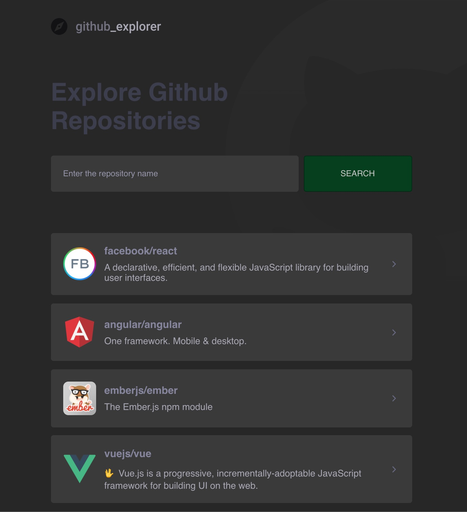
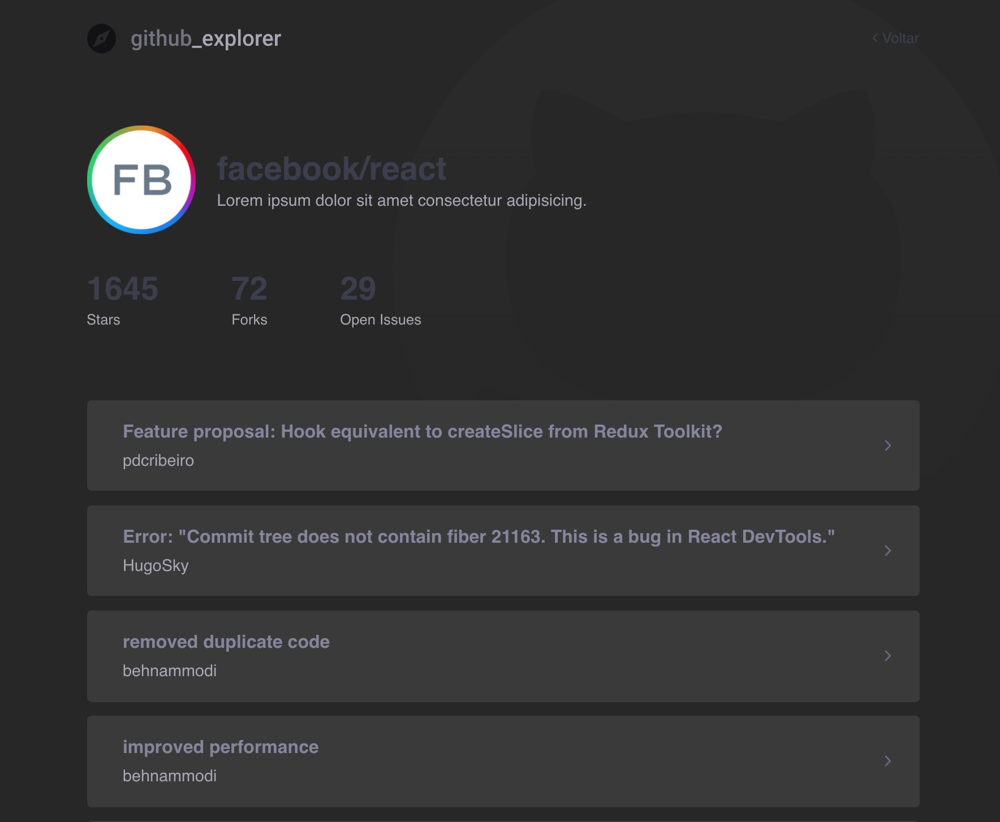

# GoStack 12
## GoStack 12 - Week 3 | ReactJS Github Explorer

Fetches repositories from Github and lists its open issues.

  
  

___

Dependencies:

* Node - v12.17.0
* React - v16.13.1
* React DOM - v16.13.1
